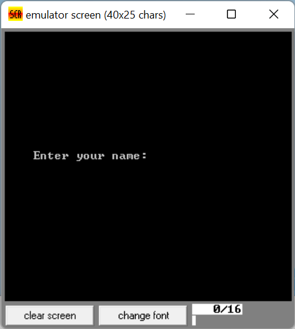
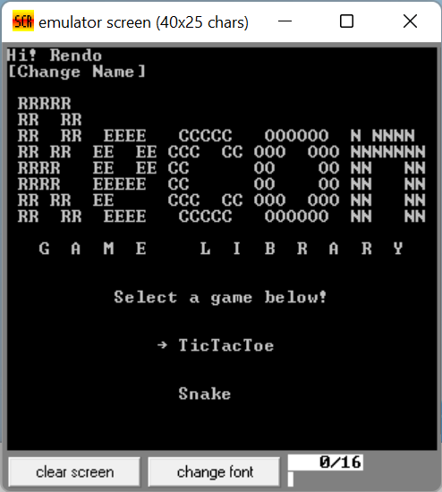
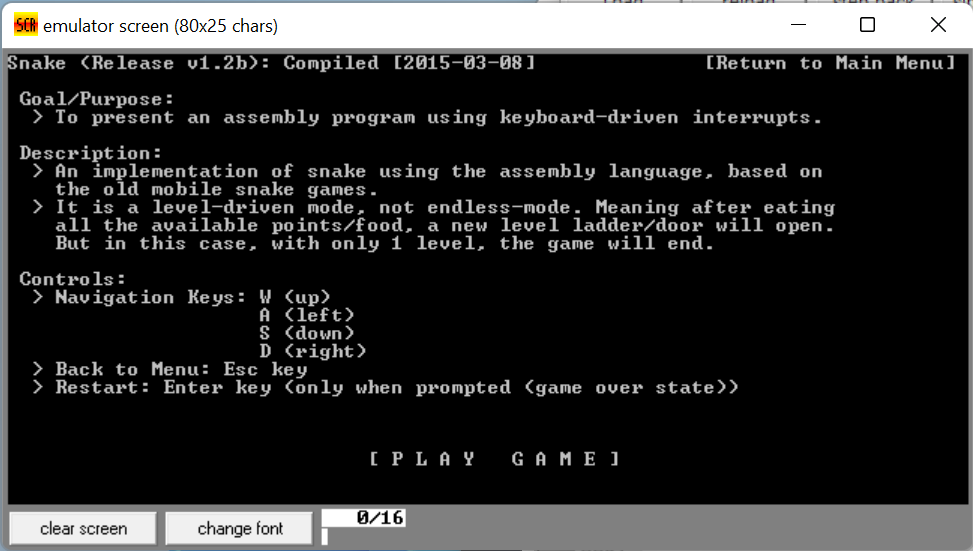
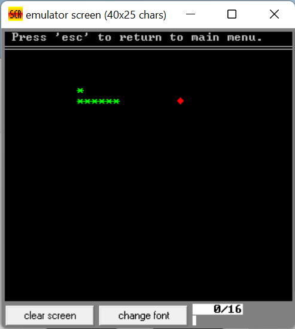
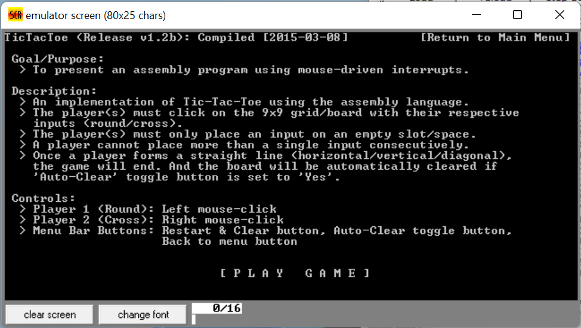
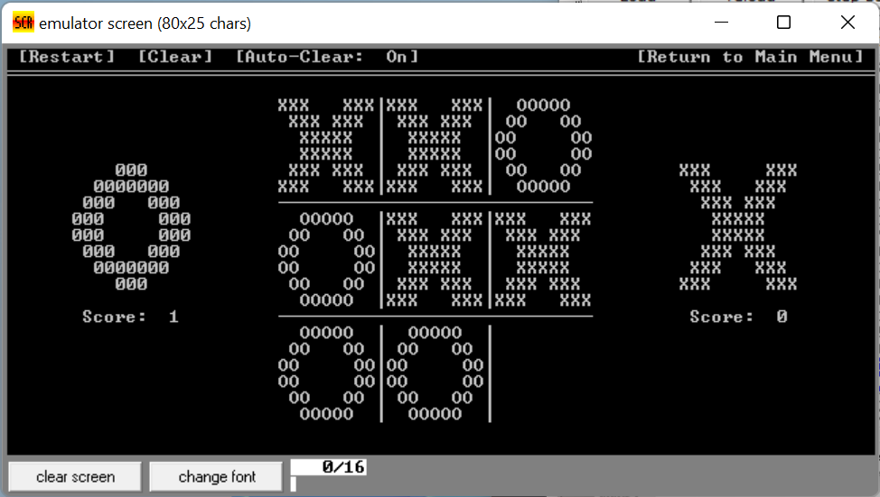

# Recon Game Library

This repository contains the source code for Recon Game Libary. The files are meant to be used in emu8086 microprocessor emulator and has not been tested elsewhere otherwise. 

This project has been completed years ago and I have no intention on making any changes or whatsoever. 

# Components

## Menu

## Snake

## TicTacToe

# Usage

- Load up the assembly file on emu8086.
  - File > Open > *select file*
- Press **emulate** button on the toolbar.
- On the emulator window, press **run** button.
- **The first run will fail** and is expected. The second run should display a name prompt before the main menu.
- Both Main Menu and TicTacToe use mouse input while both name changer and snake relies on keyboard. 
- Instructions are given for each game. Have fun!